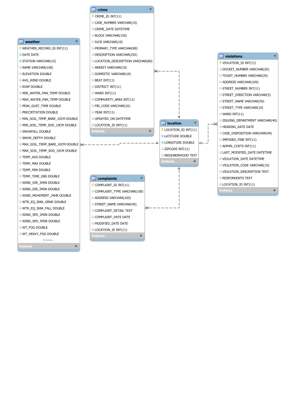
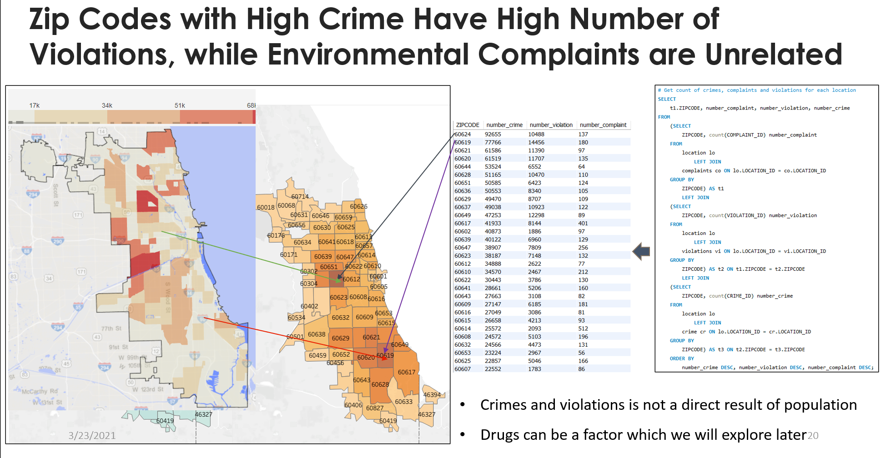

# Chicago Weather Project

The objective of this exercise is to observe how the city of Chicago changes with and adapts to extreme weather - primarily in the winter months. How temperature, precipitation, wind chill etc. affect crime, administration and ordinance violations will be the core of the project

## Contributors

* [Arpit Parihar](https://github.com/arpitp07)
* [Jiekai Ma](https://github.com/Jiekai77)
* [Curtis Zhuang](https://github.com/ethermagcian)

## Data Sources and Overview

We’re gathering data from discrete sources and making a database to validate/reject hypotheses, enable deep dives and analyses. The time period is limited to 6 years, from 2014 to 2019. The data sources are:

* Weather data – [NOAA](https://www.ncdc.noaa.gov/cdo-web/search)
* Crime data – [City of Chicago](https://data.cityofchicago.org/Public-Safety/Crimes-2001-to-Present/ijzp-q8t2)
* Violations data – [City of Chicago](https://data.cityofchicago.org/Administration-Finance/Ordinance-Violations/6br9-quuz)
* Complaints data – [City of Chicago](https://data.cityofchicago.org/Environment-Sustainable-Development/CDPH-Environmental-Complaints/fypr-ksnz)

## Data Pre-processing

* Datasets imported from csv in R to filter them from 2014 – 2019 and to recode “NA” to “\\N” for MySQL ingestion
* Data standardization done in OpenRefine to combine similar categories and reformat dates
* Coordinates reverse geocoded in python to obtain zip codes for the location table

## Database Design

### Database Design Factors

#### Business

* Database intended to be used by city officials; the user base is moderate in size
* Meant for usage primarily within Chicago, so widespread availability is not a consideration

#### Speed

* The type of the project database is OLTP
* The model is normalized in 3NF to assure high speed and low storage space consumption

#### Security

* Separate table for separate entities to keep data secure; updating one table won't influence another
* Restrict data type and set auto-increment primary key to avoid data redundancy

#### Scalability

* More records can be added to separate tables vertically
* Changes in data are reflected in individual tables, and don't have to be made multiple times

## EER Diagram

## Findings

* Zip Codes with High Crime Have High Number of Violations, while Environmental Complaints are Unrelated 

